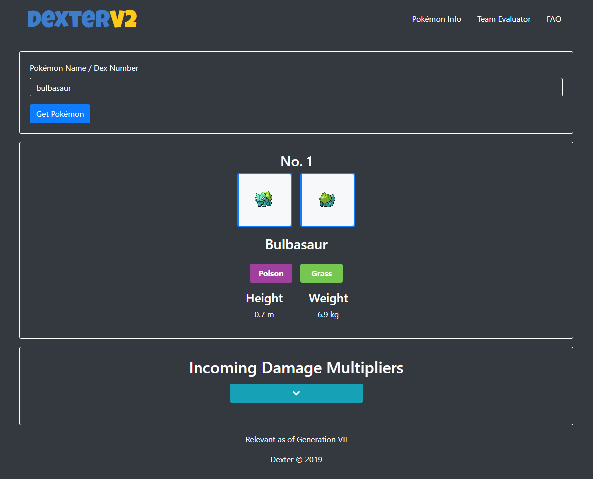
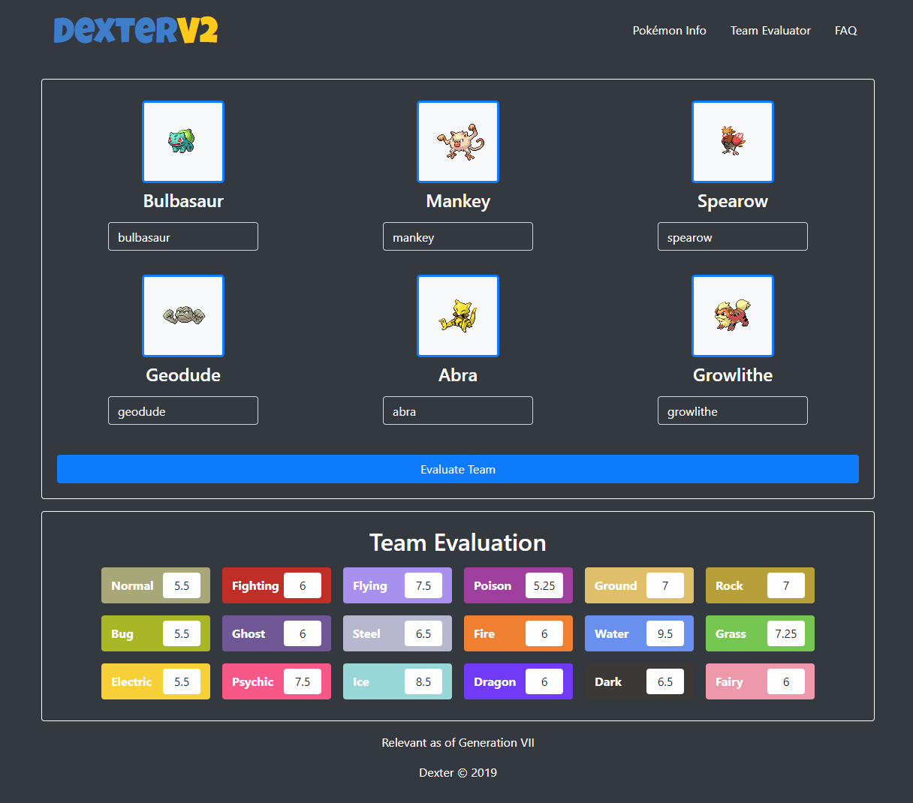

# Dexter
A tool designed to help trainers know type matchups between their 
pokemon and their opponent's so they may use them to their advantage during
battles.

# Motivation
How many times have you been in a Pok&eacute;mon battle and asked yourself, "What 
type are they again?" or "What type are they weak against?" If you're like me, 
a lot. This tool was created for this reason. It's something you can use to quickly 
lookup your (or your opponent's) Pok&eacute;mon and get valuable information
on what type they are, and what types they take the most damage from.

# Screenshots

# Features
- Pok&eacute;mon Info: pok&eacute;dex number, name, images, type[s], height, weight, and damage multipliers for received attacks.
- Team Evaluator: Takes up to six Pok&eacute;mon and forms an evaluation of the team for each attack type based on how effective attacks of that type are against each of your team members.

# Tech Used
- HTML 5
- CSS 3
- JavaScript (ES7)
- [Bootstrap 4](https://getbootstrap.com/)
  
# Other Resources Used
- [Font Awesome](https://fontawesome.com/)
- [Google Fonts](https://fonts.google.com/)

# Deployment
[DexterV2](https://morrisbc.github.io/dexter/)
